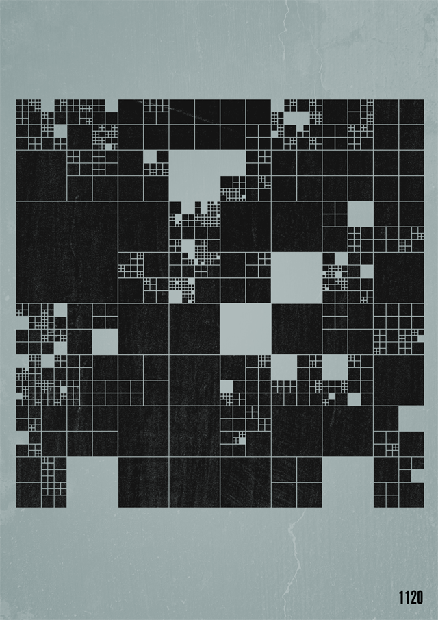
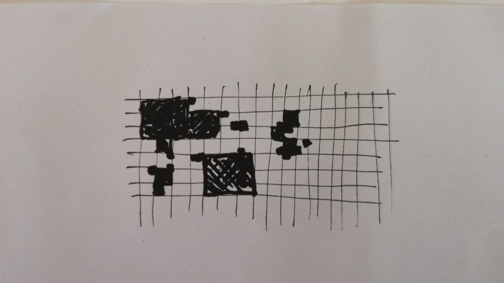
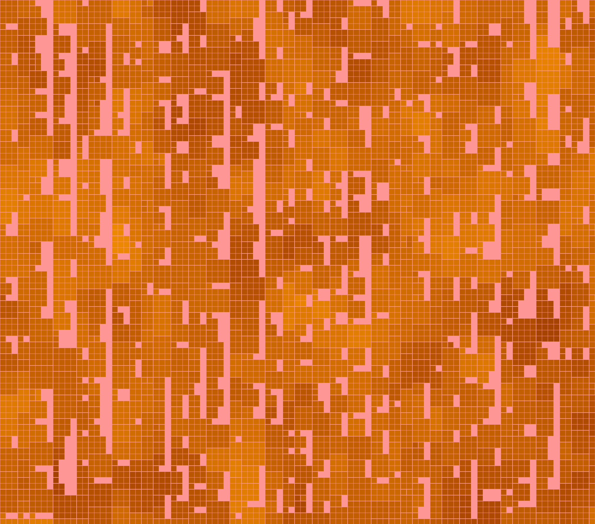
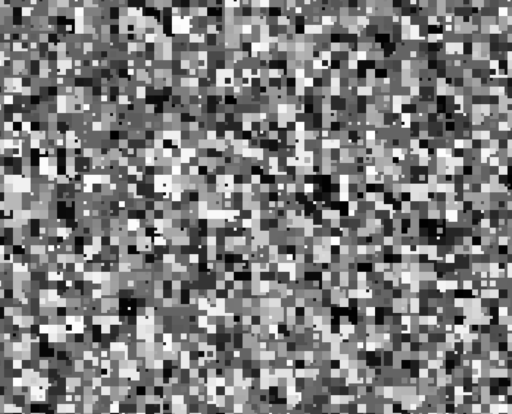
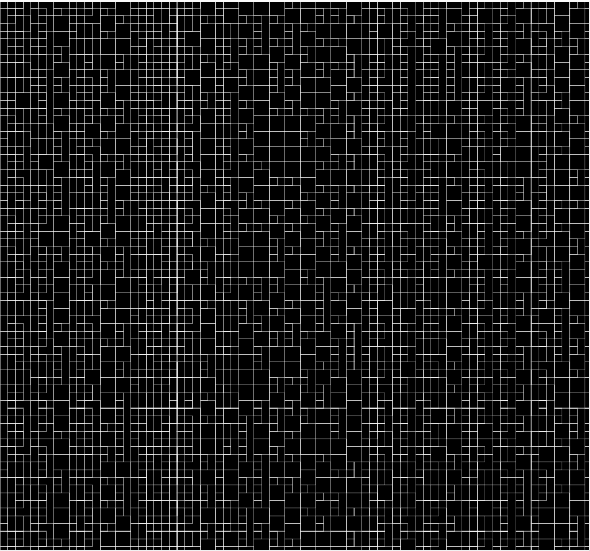
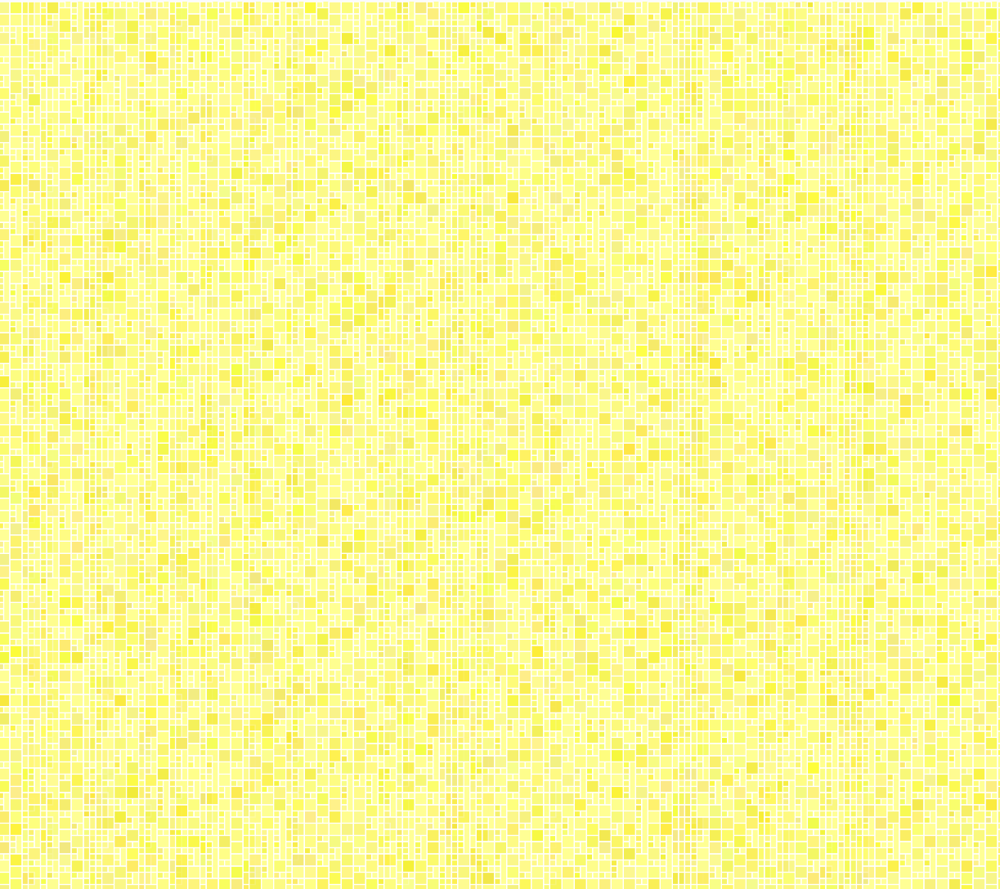
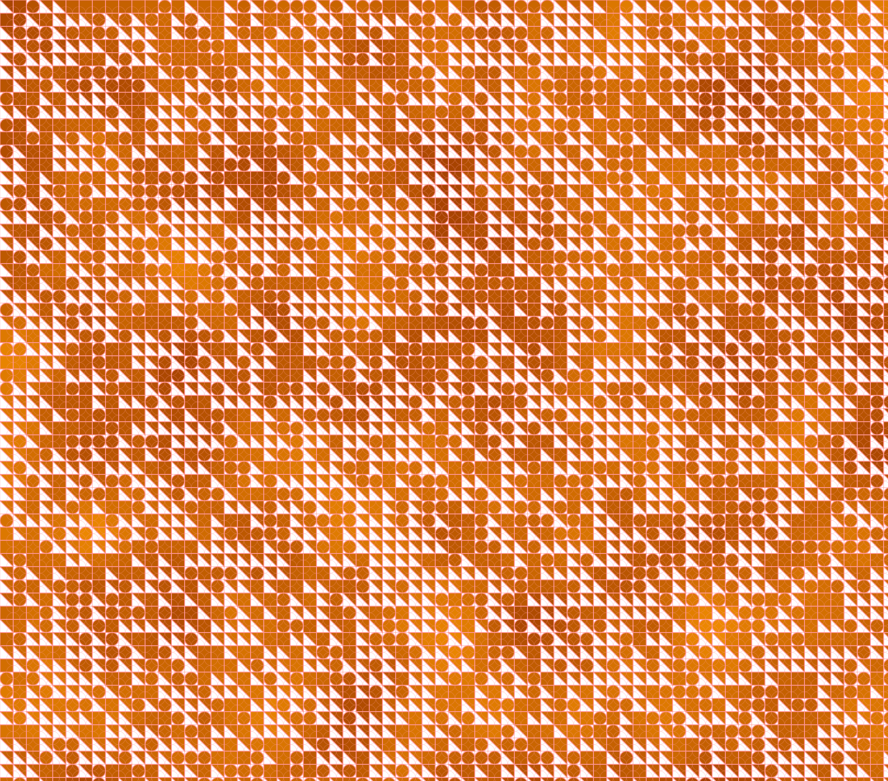
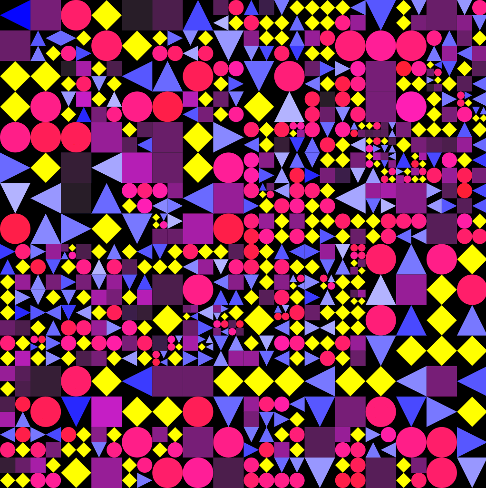

# Day 02
## Introduction 
The topic of the second day is "Grid". I wanted to work with different geometric shapes and color. A big inspiration was this grid from Fabio Franchino. I liked they way the cubes are getting divided.




## Concept

I wanted to create a Grid, but the objects could be in a random size, therefore the image would consist with big and small objects. 


## First Step

At first I created grids with 2 for-loops. Those loops passed the x and y coordinates to the objects. My plan was to start with squares and play with color

``` js
// create squares along the x and y axis of the window
function overlay(){
    for (let x = base; x < width; x += size) {
    for (let y = base; y < height; y += size) {
      strokeWeight(0.2)
      square(x, y, size);

    }
  }
}
```












## Second try
After spending some time with my first iteration, it was clear that I needed a way to subdivide the boxes, and somehow pass the new value to the object. The article from [Misha.Studio](https://editor.p5js.org/AhmadMoussa/sketches/b3xyreznH) gave me a idea how to subdivide, sadly it was in processing, which was a bit abstract for me. Luckily I found an example from Ahmad Moussa. It used recursive functions, which calls itself 4 times. On call the random function is subtracting 1 or 2 from depth. Until it reaches 0. Then the else statement will create a object.

```js

function createCell(posX, posY, wid, hei, depth){
  if(depth>0){
  
    createCell(posX, posY, wid/2, hei/2, depth-int(random([1,2])))
    createCell(posX+wid/2, posY, wid/2, hei/2, depth-int(random([1,2])))
    createCell(posX, posY+hei/2, wid/2, hei/2, depth-int(random([1,2])))
    createCell(posX+wid/2, posY+hei/2, wid/2, hei/2, depth-int(random([1,2])))

  } else {
    rect(posX, posY, wid, hei)
    point(posX+wid/2,posY+hei/2)
  }
}

```
I felt like this was simple and effective approach. Later on my journey I will add different shapes and colors to it, so easier the better. I created the grid based on the example and played around with colors and variations


## Shapes and Color

For the shapes I added a random number. Every loop the number declares what shape will be drawn into the box. the following shapes are possible: circle, diamond, triangle and square. 

``` js 

// picker variable is chosing a random number
let picker = floor(random(1, 5));
if (picker == 1) {
    fill(255, shade, colorPicker) 
    circle(posX+bWidth/2, posY+bWidth/2, bWidth);
    circle(posX+bWidth/2, posY+bWidth/2, bWidth/2);
} else if (picker == 2) {
    fill(colorPicker, colorPicker, 255)  
    push();
    translate(posX + bWidth / 2, posY + bHeight / 2); 
    rotate(90*floor(random(1,5))); 
    triangle(-bWidth / 2,-bHeight / 2,bWidth / 2,-bHeight / 2,0,bHeight / 2);
    pop();
} else if (picker == 3) {
    fill("yellow")  
    push();
    translate(posX + bWidth / 2, posY + bHeight / 2); 
    rotate(45); 
    square(-bWidth/2*.7 ,-bHeight/2*.7 , bWidth*.7);
    pop();
} else {
    fill(colorPicker, shade, colorPicker) 
    square(posX, posY, bWidth);
}
    
```


## Animation
For the animation I set the framerate to 1 and changed the subdivision of the boxes. So every second a new image appears with different shapes, colors and sizes. It loops from very small to very big and so on. 




#### Code
Here you can check out the [code](https://editor.p5js.org/Fimo/sketches/m0jzQCZGl)


#### Ressources
[Article about Subdividing Grids](https://medium.com/@misha.studio/process-ing-generative-irregular-grid-8f0d712dfaa4) \
[Coding Example for Subdividing Grids in p5](https://editor.p5js.org/AhmadMoussa/sketches/b3xyreznH)


#### Variations
[Variation 1](https://editor.p5js.org/Fimo/sketches/VcXy_JHy6) \
[Variation 2](https://editor.p5js.org/Fimo/sketches/14-LG9uNV) \
[Variation 3](https://editor.p5js.org/Fimo/sketches/UEgjb_PaM) \
[Variation 4, Recursive ](https://editor.p5js.org/Fimo/sketches/m0jzQCZGl) \