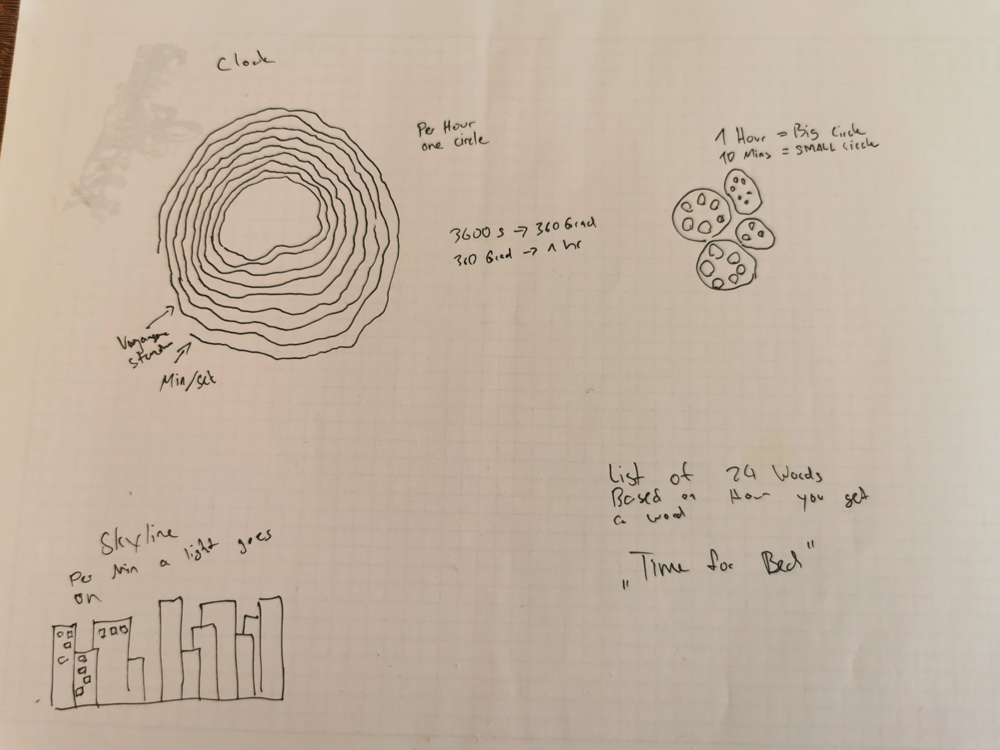
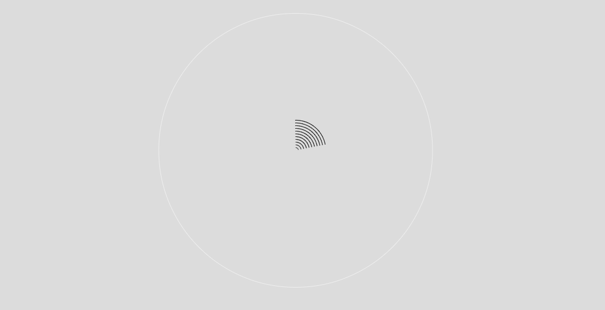

# Day 03
## Introduction 

The topic of the day is "CLOCK." The assignment was to create a concept for a clock. I once created a clock in p5, but my issue at that time was that I didn't implement a loop. My clock was quite linear.

## Concept
I immediately thought of tree rings. Trees usually have rings that indicate their age and the quality of the year they've had. For my concept, I used these rings to represent hours. From the outset, I knew there were two things to consider: creating vertex points based on the hour and adding some noise for an organic feel.




## Coding

### First Step
Initially, I created a for-loop. Each ring represents an hour, and the distance is based on the seconds. I used seconds to give the clock a better sense of time. In the final code, the last circle will be based on minutes and seconds.



I extracted the current hour from the loop and added a separate loop


### Noise
After setting up the basics and displaying the time correctly, I focused on the visual aspect of the clock. I aimed for a natural, organic feel, so I incorporated noise. The basic idea was to create a loop with noise so that it would loop seamlessly. I used "sin()" and "cos()" for rotation, both for the noise and for determining the x and y values of the vertex points. In the "noise" function, I included these two variables to describe the coordinates.[Guillaume's Example](https://editor.p5js.org/guma/sketches/0hvdq_lsW) demonstrates how noise can be effectively looped. 

```js 

  beginShape();
  for(let r = 0; r <= 60; r+= 1){
    radiusBig = map(r, 0, 60, 0, 360)

      noiseX = (sin(radiusBig))*noiseScale
      noiseY = (cos(radiusBig))*noiseScale
      x = (sin(radiusBig)*hourRadius)
      y = (cos(radiusBig)*hourRadius)
      curveVertex(x+noise(noiseX)*amplitude, y+noise(noiseY)*amplitude)
  }
  endShape(CLOSE)

```   
#### Happy accidents during the buildup
.png)
.png)
.png)
.png)

After some time, I realized that the noise was mirrored. It created an interesting effect, but perhaps not suitable for this project. After discussing it with Professor Guillaume Massol, we discovered that I had forgotten to include the second values for the noise function. So, my coordinates were essentially moving only along the x-axis of the noise. After adding both values to the noise function, I achieved the desired effect.

```js 

  beginShape();
  for(let r = 0; r <= 60; r+= 1){
    radiusBig = map(r, 0, 60, 0, 360)

      noiseX = (sin(radiusBig))*noiseScale
      noiseY = (cos(radiusBig))*noiseScale
      x = (sin(radiusBig)*hourRadius)
      y = (cos(radiusBig)*hourRadius)
      curveVertex(x+noise(x, noiseX)*amplitude, y+noise(y, noiseY)*amplitude)
  }
  endShape(CLOSE)

```   

I wanted to add more interaction. The current path for minutes and seconds was slowly moving, but it wasn't enough. I experimented with slow movements based on the elapsed seconds. It was suitable for a clock, but the visuals needed to feel natural. So, I linked the amplitude of the noise to the mouse position.


After reading the documentation, I tried using orbitalControls, but the performance with noise was subpar. So, I returned to the original idea.



<iframe src="content/day03/01/embed.html" width="100%" height="600" frameborder="no"></iframe>


[Code](https://editor.p5js.org/Fimo/sketches/gbDjPk3XT)

### Sources
Looping Noise:\
[Guillaume's Example on looping Noise](https://editor.p5js.org/guma/sketches/0hvdq_lsW) 
[Blogpost on looping Noise](https://necessarydisorder.wordpress.com/2017/11/15/drawing-from-noise-and-then-making-animated-loopy-gifs-from-there/)


Inspiration\
[AM (Arctic Monkeys album)](https://en.wikipedia.org/wiki/AM_%28Arctic_Monkeys_album%29)