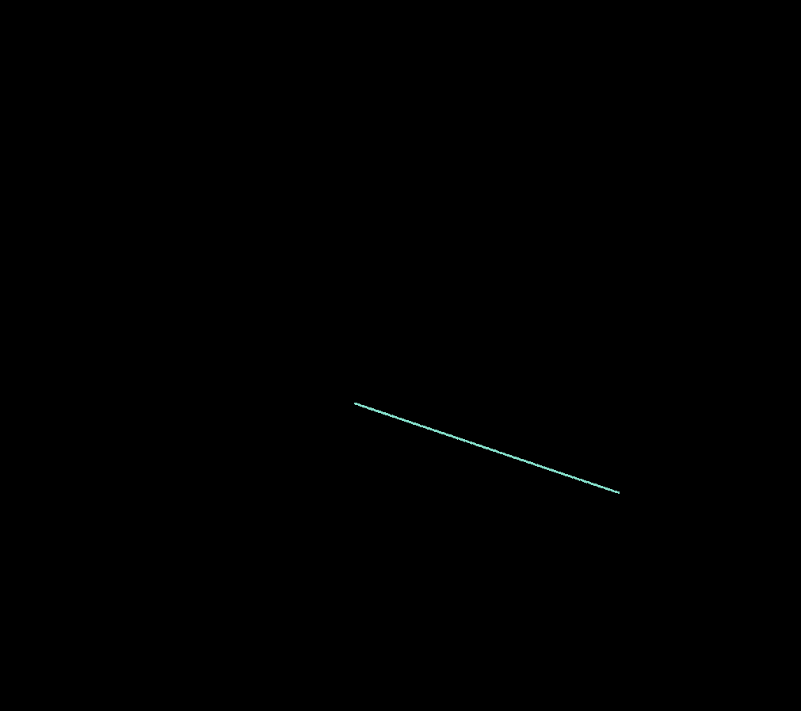
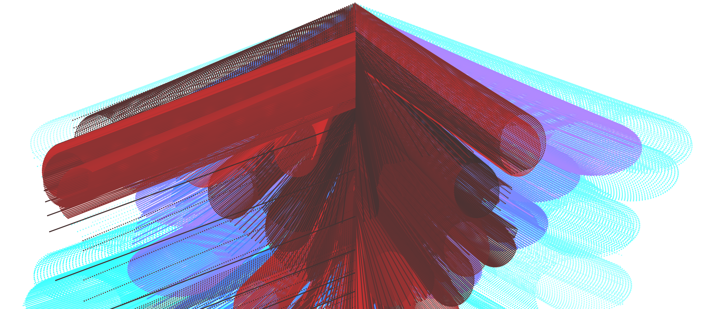
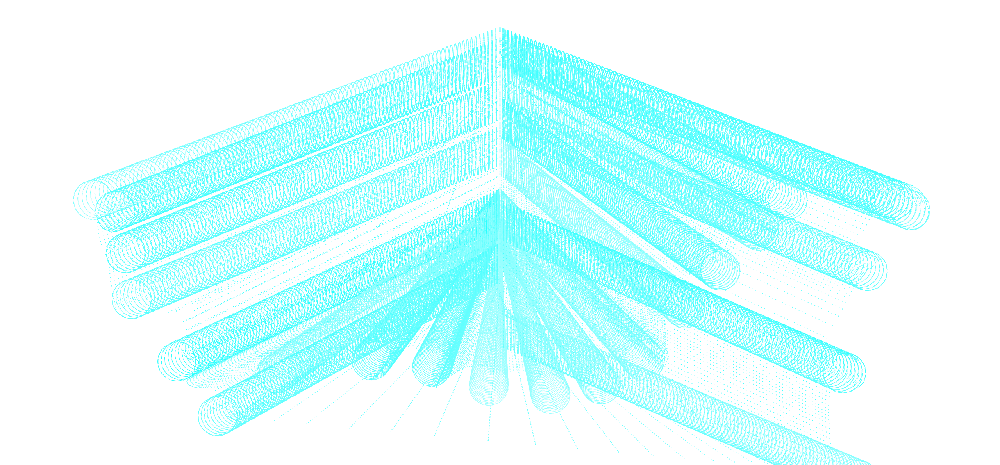
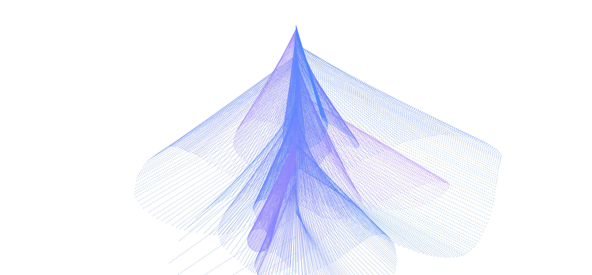
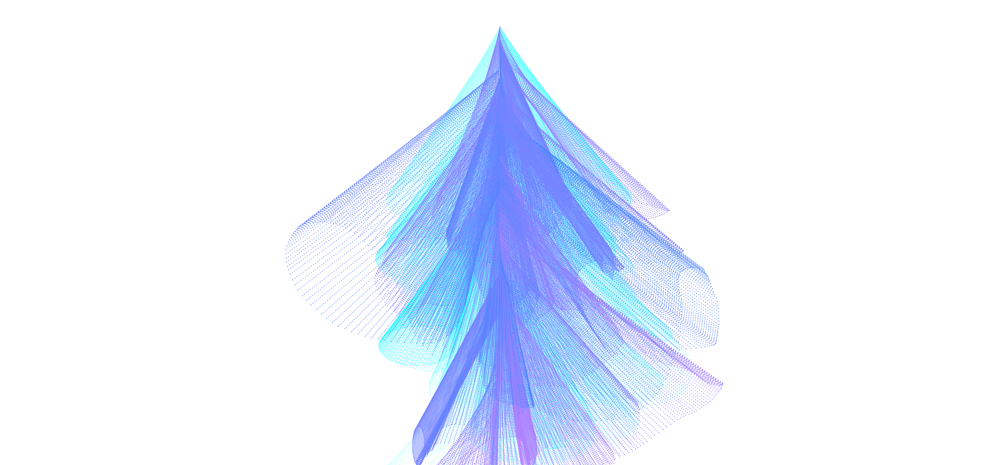

# Day 04
## Introduction 
Topic of the fourth day is "Machine". 

"Create a program that expands, augment, distort, questions, complicate, interpret, improves the act of drawing. Explain what your system is about: is it a tool? A statement? a game? Use your tool to create your original series of at least 3 drawings."

## Concept
I wanted to create a "Machine", that takes user inputs like mouseX, mouseY or sliders and draws shapes based on the values. 

After reading the blogpost from [NecessaryDisorder](https://necessarydisorder.wordpress.com/2018/03/31/a-trick-to-get-looping-curves-with-lerp-and-delay/) about looping curves and delays, I found out about the lerp() function. lerp is useful for interpolation. It creates an echo-like effect. 

```js 
// starting point, stopping point, amount
  for (let i = 0; i <= density; i+= 1){
    tt = 1*i/density 
    x = lerp(x1,y1,tt)
    y = lerp(y1,y2,tt)
    point(x,y)
  }
```


<iframe src="https://editor.p5js.org/Fimo/full/Jq-OmvhGN" width="100%" height="450" frameborder="no"></iframe>


In my first Iteration I had two circles and the interpolation. I played around the with the values to see how I could create some form of interaction


After binding the Y-position of one circle to the center of the screen, I felt like painting flowers or trees




In my final version I added sliders for amount of interpolation, height of circle, and values for RGB. 


<iframe src="content/day04/01/embed.html" width="100%" height="800" frameborder="no"></iframe>









#### Code
here you can check out the [code](https://editor.p5js.org/Fimo/sketches/67vYRL3Oj)


#### Ressources
[necessary-disorder tutorial on lerp()](https://necessarydisorder.wordpress.com/2018/03/31/a-trick-to-get-looping-curves-with-lerp-and-delay/)