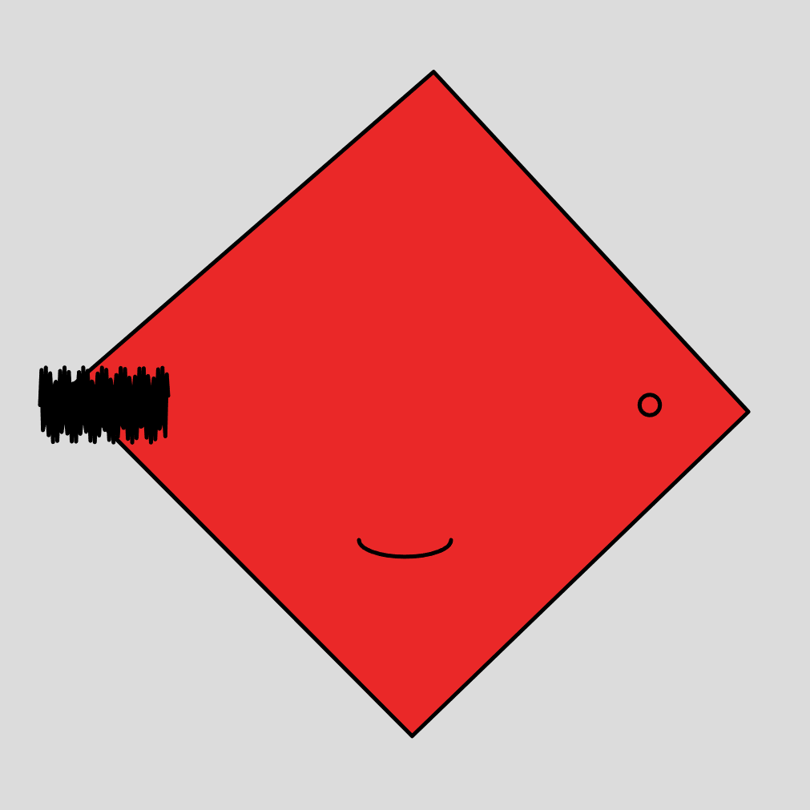
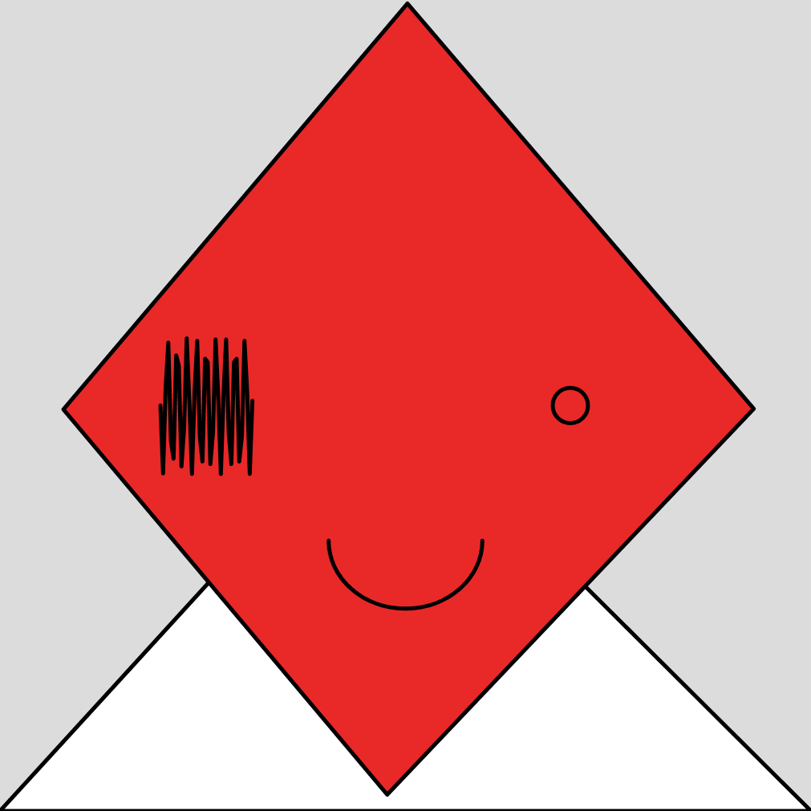
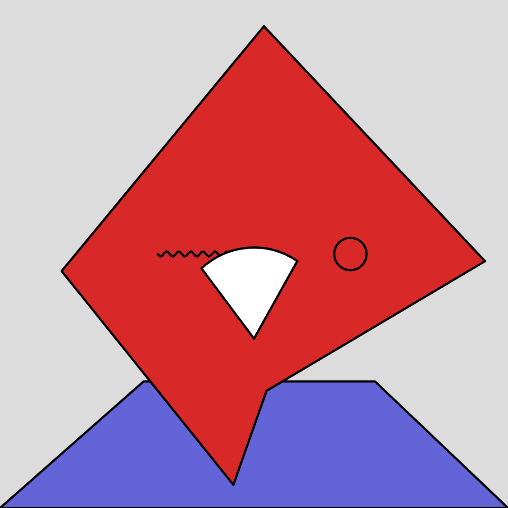
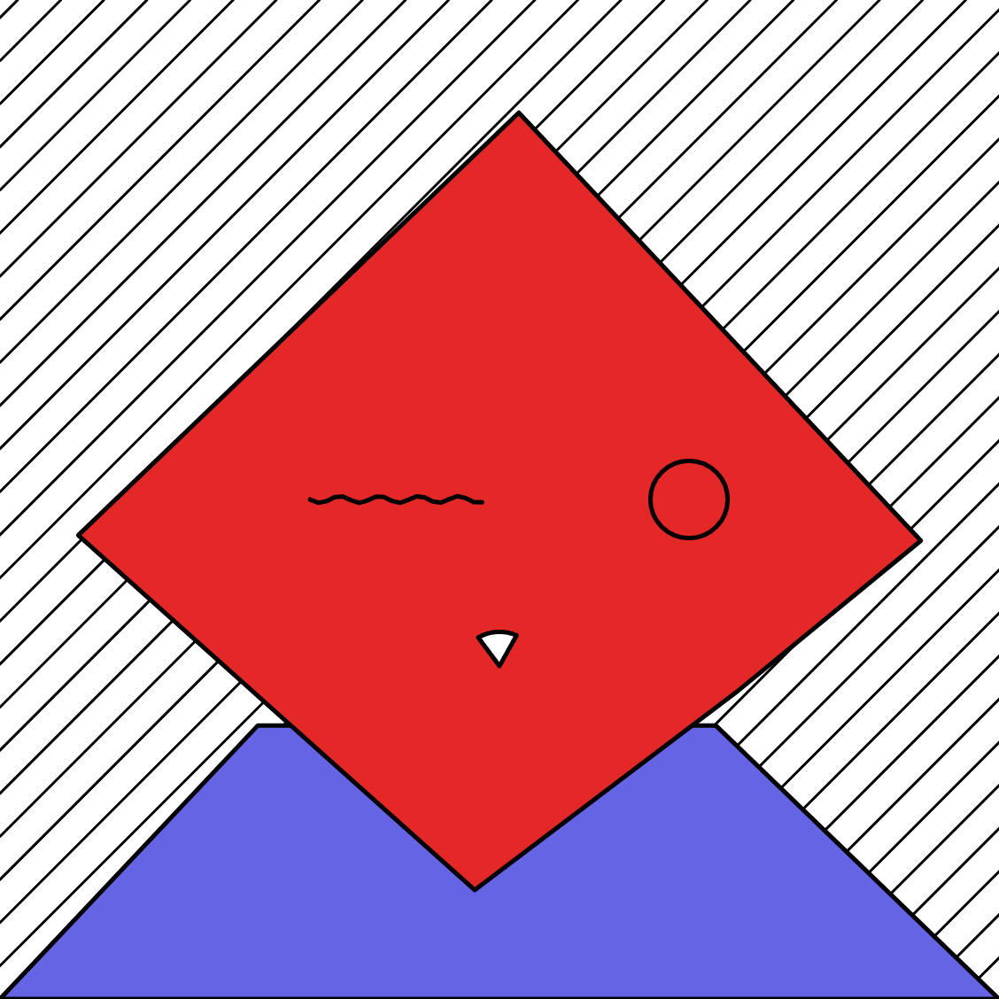
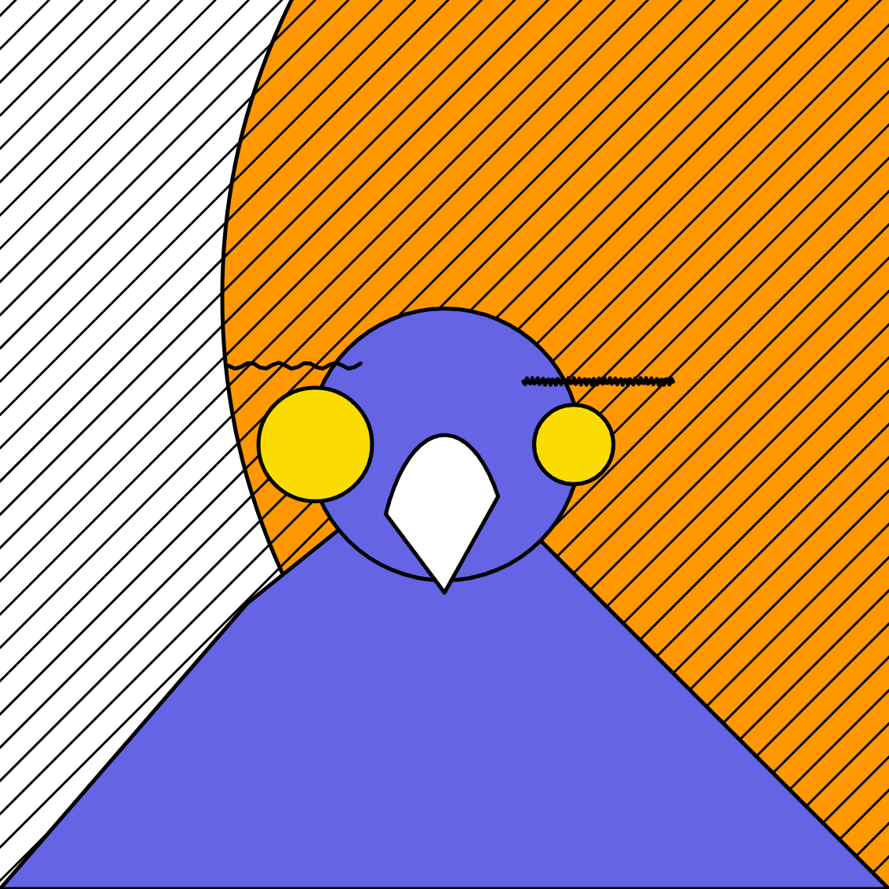
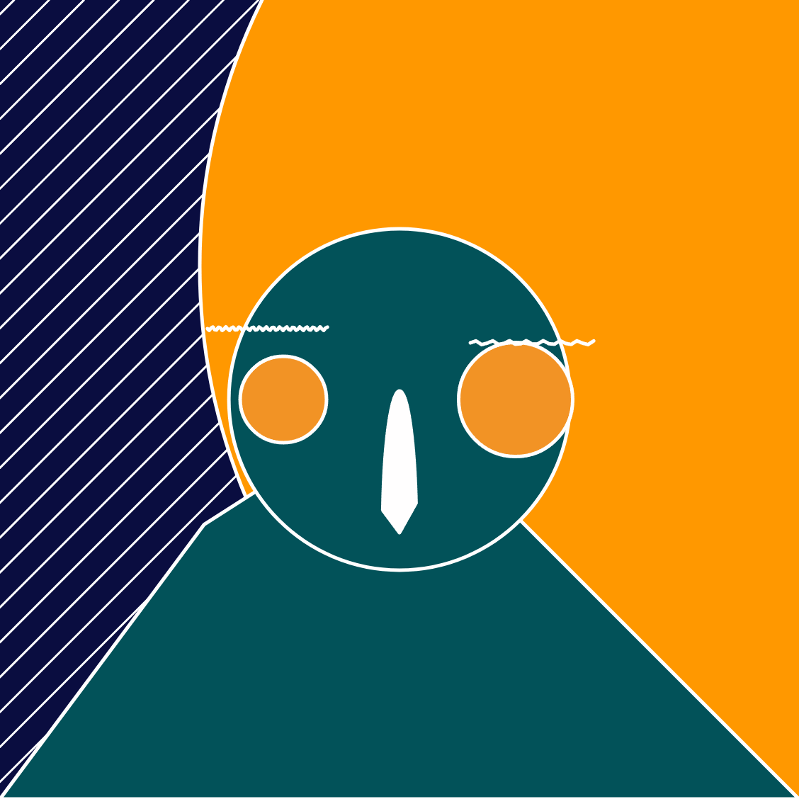

# Day 05
## Introduction 
Topic of the fourth day is "Faces". 


## Concept
I aim to create a program that generates faces using basic shapes. I want the face to have a playful expression, with one eye winking. The canvas will have a frame rate of 1, giving it a subtle animation effect.

I'll create a function for each facial component and incorporate randomness into the design. I'll provide a range for the random function to introduce variability. Initially, I experimented with basic shapes like wiggly eyes and a mouth while also exploring unique head shapes.




During my experiments, I noticed that the closed mouth resembled a bird's beak. In subsequent iterations, I fine-tuned the values. For the head, I introduced a random anchor point to break away from the rectangular shape. I wanted to follow the bird idea because the beak is usually of intergrated in my sketches.





To enhance the composition, I transformed the eyes and head into circles, leveraging the random waves for expressive eyebrows. In further iterations, I added a background pattern with random paddings.



To introduce intriguing yet random colors, I created two arrays of colors. I experimented with changing the stroke color based on the background's darkness but ultimately found that the white stroke added a calming element to the image.

``` js
let eyeColor = ["#F29325", "#F2133C"," #F2561D"]
let bodyColor = ["#025259","#007172", "#0A0D40", "#114BBF"]
let backgroundColor = ["#0A0D40", "#F4E2DE"]
```

A fortunate coincidence occurred when the screen width affected the width of the shoulders, resembling a bird-man when viewed on wider screens.




#### Code
[Variation 1](https://editor.p5js.org/Fimo/sketches/QFqQVN9CX) \
[Variation 2](https://editor.p5js.org/Fimo/sketches/MCX2_aodc) \
[Variation 3](https://editor.p5js.org/Fimo/sketches/NXjsbFScq) \
[Variation 4](https://editor.p5js.org/Fimo/sketches/pQppFgRb8) 