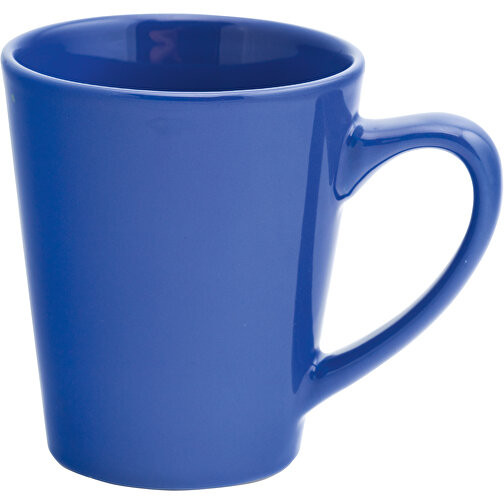
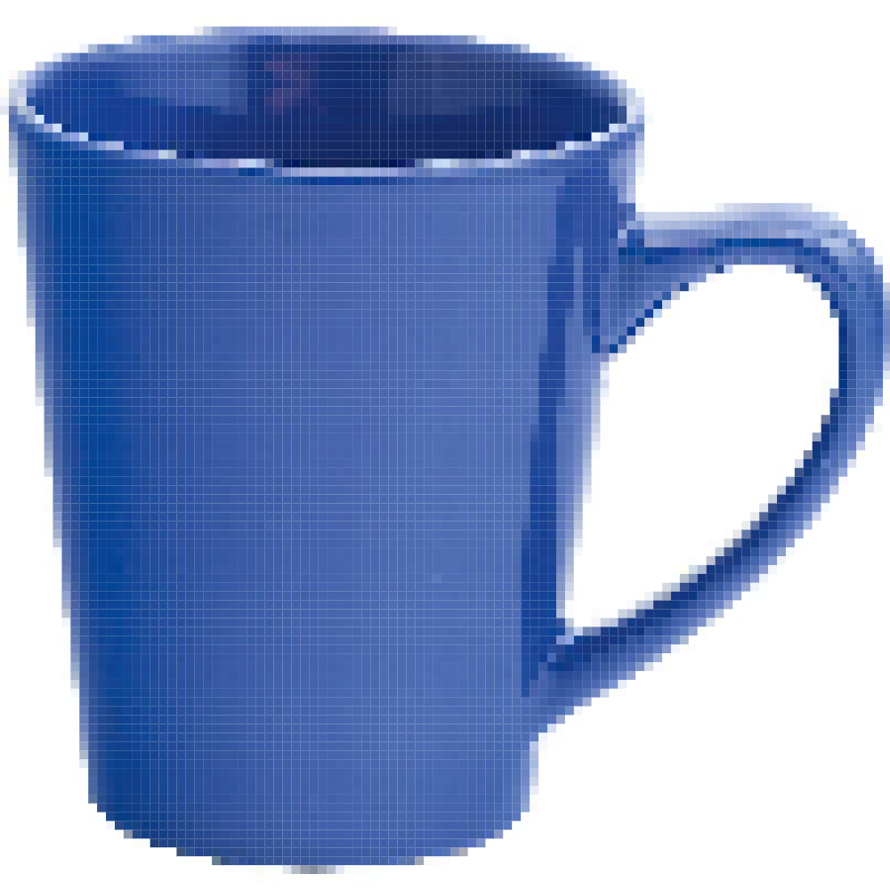
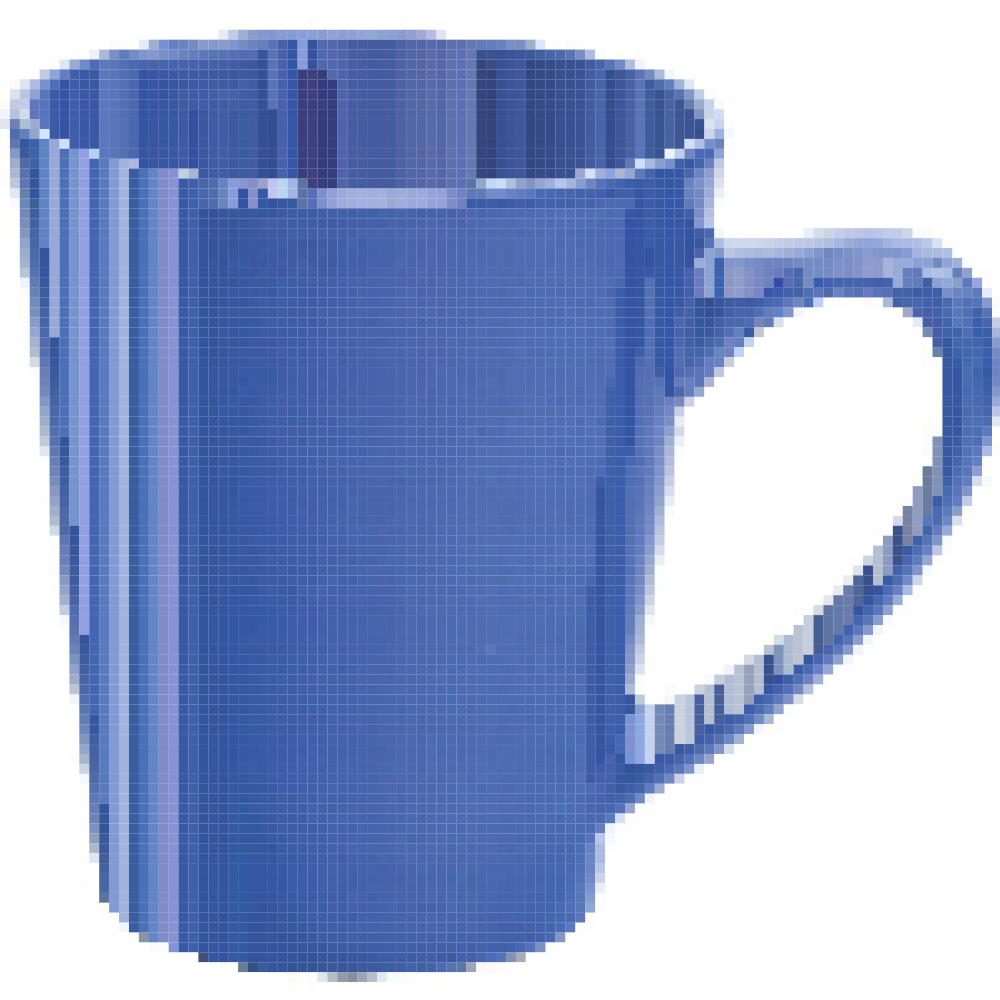
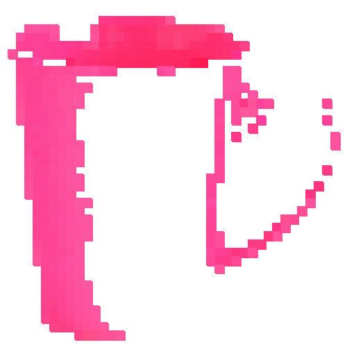
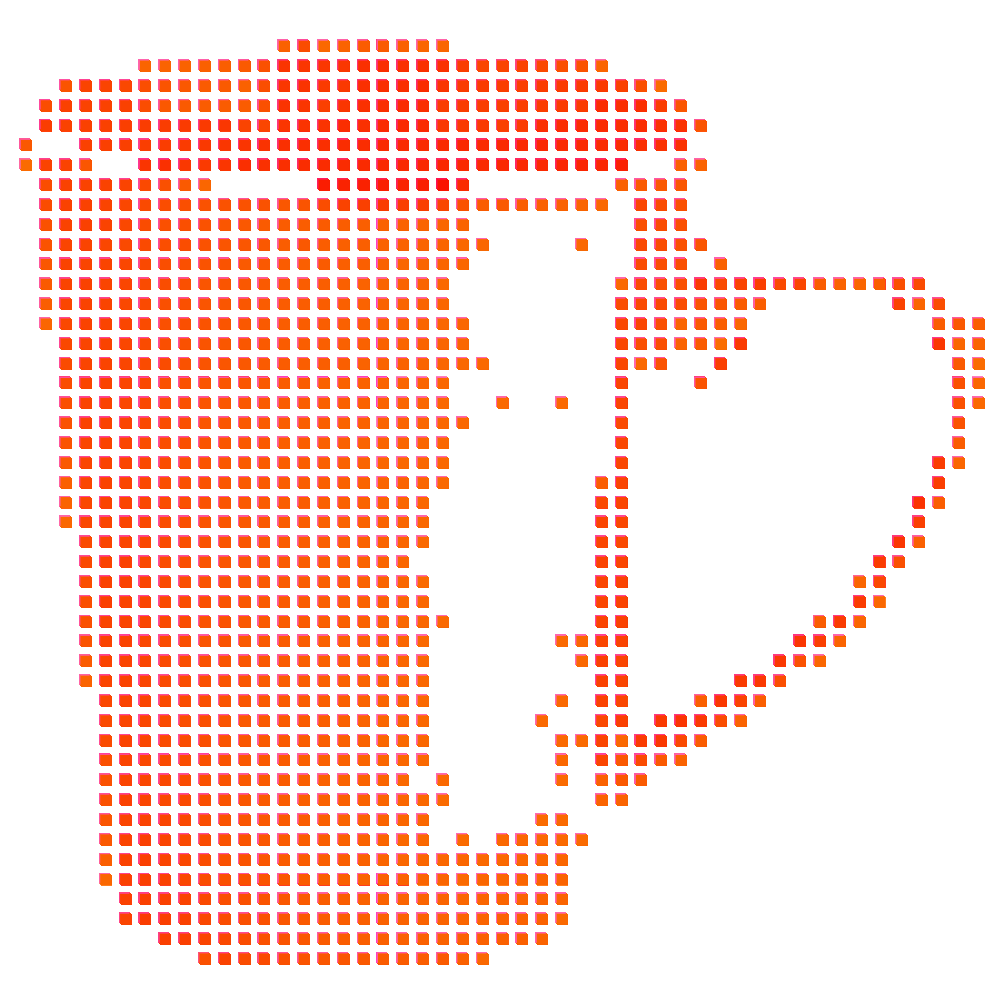

# Day 06
## Introduction 
Topic of the fourth day is "Pixels". 

## Concept
I wanted to create some sort of bug like in this (example)[wwww]. But first I needed to learn how to manipulate pixels. I have absolute no experience except maybe photoshop. So I have a rough idea, what technically would be possible. So this photoseries shows my progress:

First I loaded the cup. In my mind it was a good idea to have a image with a white background. So I knew I could filter those empty pixels out. From this point onward I loaded the pixels into my canvas and tried to manipulate it. 

#### The image

#### Pixels loaded onto the canvas

#### Changing the size of the grid

#### Changing pixels based on the their value

#### Adding pixels
Here I used the x and position and added squares with different color and close coordinates to it. Here sparked the idea of a gradient. 

#### Testing with 3d 
I tested with OrbitControls what happens if I offset or copy pixels and transform them in the Z-Axis

#### Pixel Shifting
Soon after that I wanted to create a image, that works with the depth of the grayscale. The pixels take the average of RGB as a position in the 3d-space

#### Ressources
[Image Processing](https://idmnyu.github.io/p5.js-image/index.html) \
[Generative Gestaltung](http://www.generative-gestaltung.de/2/) \

https://p5js.org/reference/#/p5/get