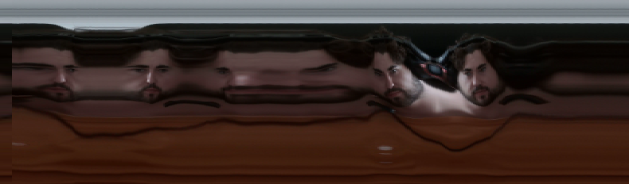
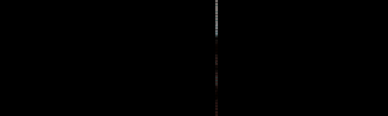
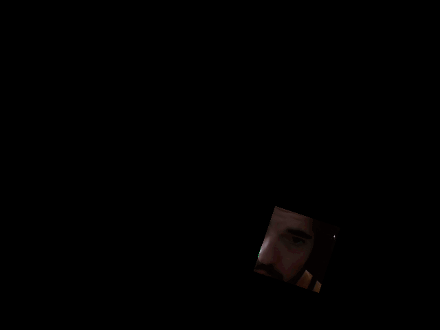
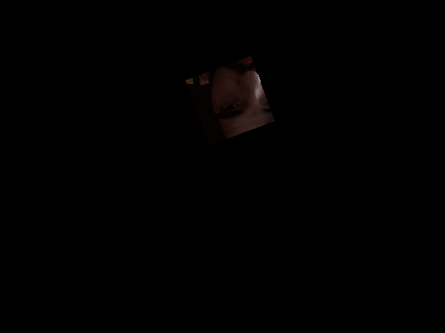

# Day 07
## Introduction 
The topic of the fourth day is "Split-scanning." For the research part, I examined two sources: one is the [list by Golan Levin](https://flong.com/archive/texts/lists/slit_scan/index.html), and I found myself greatly inspired by [François Vogel](https://twitter.com/francois__vogel). I knew this was probably too advanced for now. 


<blockquote class="twitter-tweet"><p lang="en" dir="ltr">jellyfish cat <a href="https://t.co/TLk78J6jwr">pic.twitter.com/TLk78J6jwr</a></p>&mdash; françois vogel (@francois__vogel) <a href="https://twitter.com/francois__vogel/status/1625861236742328320?ref_src=twsrc%5Etfw">February 15, 2023</a></blockquote> <script async src="https://platform.twitter.com/widgets.js" charset="utf-8"></script>


## Concept
Initially, my goal was to understand how it's done and gather inspiration during my journey. Therefore, my first attempt was the most basic iteration of split scanning. As with many things in p5, there's likely a [video](https://www.youtube.com/watch?v=YqVbuMPIRwY&ab_channel=TheCodingTrain) by Daniel Shiffman explaining it. 

```js
  video = createCapture(VIDEO)
  video.size(320,240)
  video.loadPixels()
  var w = video.width
  var h = video.height

  //copy (source, sx, sy , sw, sh, dx, dy, dw, dh)
  copy(video, w/2,0,1,h,x,0,1,h)
  
  x += 1
  
  if (x > width ){
    x = 0
  }
```




### Mixing techniques
After the last iteration, I discovered that small distances could create an intriguing and somewhat chaotic pattern. I aimed to break away from the purely left-to-right movement and introduce a more overall sense of "movement." I recalled a technique from day 6, demonstrated by [Generative Gestaltung](https://editor.p5js.org/generative-design/sketches/P_4_1_2_01), which involves taking random parts of the image and offsetting them slightly. This is achieved through a combination of the set() and get() functions


```js
// coordinates where its going to be placed
var x1 = floor(random(width));
var y1 = 0;

//  which pixels are going to be copied
var x2 = round(x1 + random(-7, 7));
var y2 = round(y1 + random(-5, 5));

//  which pixels are going to be copied
var w = floor(random(100, 400));
var h = height ;

set(x2, y2, get(x1, y1, w, h));
```




### Continuous
I felt like that all iterations to this point were very linear. So I tried to create something radial. 




### Thoughts
I think, it would be a interesting idea for video editing, concert visuals or installation. Usually in my work the output needs to look the same all the time. But with the camera as input it makes it difficult to control. 


### Code 
Here you can check out the code for all iterations.\
[Code 1](https://editor.p5js.org/Fimo/sketches/xW6RZt5GJ)\
[Code 2](https://editor.p5js.org/Fimo/sketches/rbOEqM4DM)\
[Code 3](https://editor.p5js.org/Fimo/sketches/J0sG3RFzZ)\
[Code 4](https://editor.p5js.org/Fimo/sketches/L_MDZpIG8)\
[Code 5](https://editor.p5js.org/Fimo/sketches/GmD1u-3BW)\
[Code 6](https://editor.p5js.org/Fimo/sketches/-LRBHceVs)


#### Ressources
[Image Processing](https://idmnyu.github.io/p5.js-image/index.html) \
[Generative Gestaltung](http://www.generative-gestaltung.de/2/) \

https://p5js.org/reference/#/p5/get