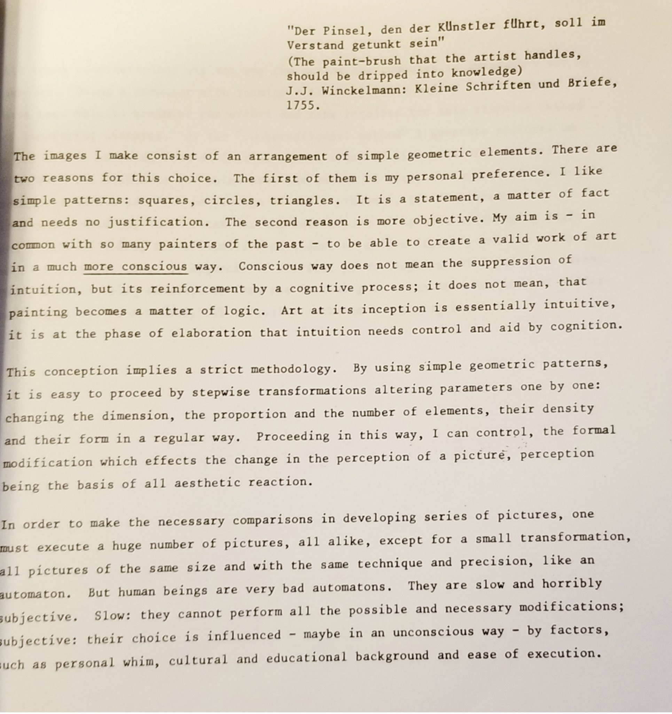
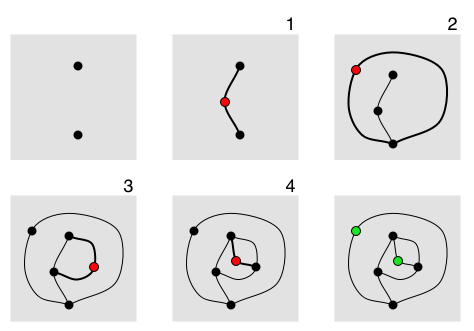
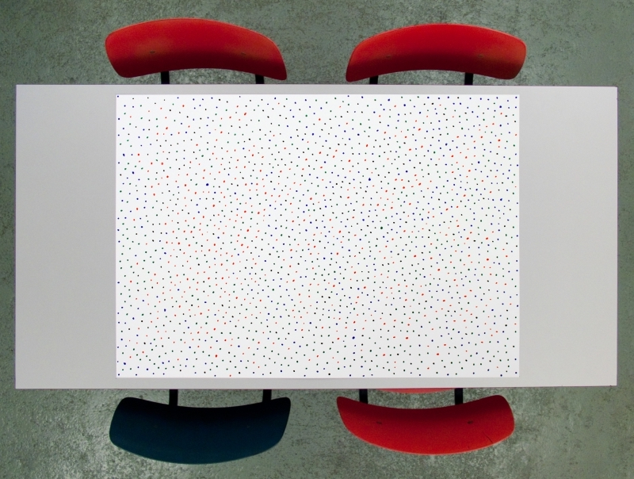
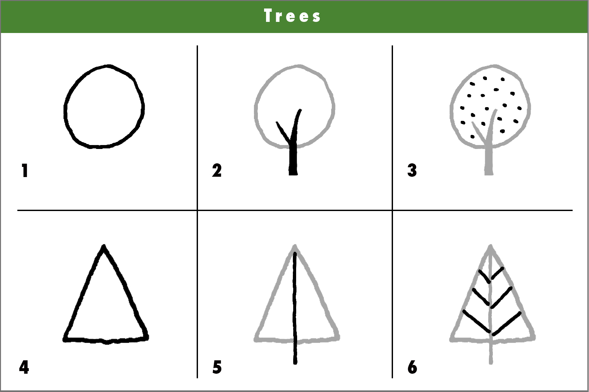
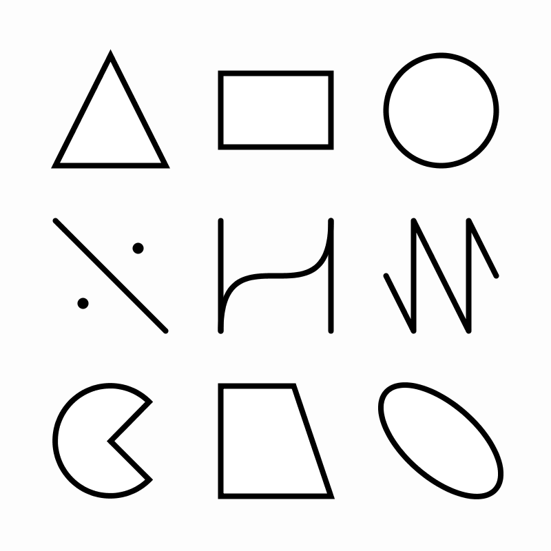

# Day 01

Welcome to the classes generative design @ HSLU / Digital Ideation. This is the main page for the class, you will find a list of resources available below as well as some other information to help with this 3 weeks workshop. It is advised to download / clone this repo at the beginning of the class and eventually keep the `master` branch updated. All assignments / exercises should be done by students on the `journal` branch or some other _"blogging platforms"_ if preferred.

  
_#veramolnar sharing her artistic process and the profound evolution and revolution of #generativeart in the 1980s unknowingly creating a historic artist statement for time immortal…_  
[> Source](https://twitter.com/michaelspalter/status/1442482576283869184)

## Schedule

|Time               |Desc                                      |
|---                |---                                       |
|9:30 - 10:30       | Intro Me + You                           |
|10:30 - 10:45      | Repo                                     |
|10:45 - 11:00      | Break                                    |
|11:00 - 11:30      | Computing without computer (part01)      |
|11:30 - 12:00      | Computing with computer (part01)         |
|12:00 - 13:00      | Lunch break :hamburger:                  |
|13:00 - 14:00      | Computing without computer (part02)      |
|14:00 - 15:00      | Computing with computer (part02)         |

## Intro

* Me
    * [Intro][url00]
    * Class
    * Philosophy
        * [Peer Learning](https://42.fr/en/what-is-42/the-42-method/)
        * [Three before me](https://practices.learningaccelerator.org/strategies/3-before-me)
        * Different levels -> Help others, produce content for the class.
    * [History][url01]
    * [Tools](#tools) (digital + physical)
    * Relax VS Strict / Expectations
    * Produce content that can be shared
    * Journaling
* You
    * Intro - You
        * Questions / Expectations
            * 1 sentence on post-it (Feelings / not tech)
            * Research driven by questions
    * Getting help
        * How to ask for help
        * Pair programming
        * Code of conduct (OSS, etc...)
    * Giving feedback:
        * Exit tickets: 2 Questions at the end of each class (what form? Slack?)
        * Critique and Feedback: interactive (Slack? G docs? Questionnaire?)

## Computing wihtout computer

### Sollewit: [Wall drawing 118][url03] _(30 mns)_

Fifty randomly placed points all connected by straight lines.

### John H. Conway & Michael S. Patterson: [Sprouts][url02] _(30 mns)_ 

The game starts by drawing any number of spots. For example 3 spots. The first player has a turn by joining two of the spots and marking a new spot in the middle of the line. Or the line may start and end on the same spot.

You are not allowed to draw a line which crosses another line. A spot cannot have more than three lines leading to or from it.  The idea is to make it impossible for the other player to draw a line. So the last person to draw a line is the winner.

  
[> Source][url02]

### Moniker: [The beach](https://conditionaldesign.org/workshops/the-beach/) _(30 mns)_

Roel: "entering the beach on a sunny day you will look for an empty place and position yourself right in the middle". - A fascinating form of self organization.

  
[> Source](https://conditionaldesign.org)

### Procedural Drawing: _(30 mns)_

Develop your own procedural drawing instructions based on [Sol Lewitt's work](https://massmoca.org/sol-lewitt/) or some prompts from [Conditional Design](https://conditionaldesign.org/archive). Have one or more of you peers produce a drawing from this system. 

  
[> Source](https://conditionaldesign.org)

### More...

* [Thread on art done without computers](https://twitter.com/m_pf/status/1442047197214756866)

## Computing with computer

### 1) Getting familiar with the software

Complete the intro and some of the tutorials from [P5.js learn page](https://p5js.org/learn/)

### 2) Draw then code

Make a simple drawing and try to reproduce it with code.   

### 3) One with everything

Draw all possible geometric shapes you can generate with your software.  
  
[> Source](https://github.com/CodeAsCreativeMedium/exercises/tree/main/01_graphic_elements/01_one_with_everything)

### 4) Iteration + randomness 

Build a grid, add some randomness to it (different elements in the grid).

### 5) Map

Build a map of an imaginary place.

## Deliverables

* Documentation and thoughts on Computing without computers (photos, short analysis & take away from the games)
* Code and documentation on Computing with computers, start writing about it in your journal, add some gifs.
* Include a scan or photo of your drawings in the post(s).

## Tools

We will use [__p5.js__ ](https://p5js.org/) for the front end. It’s a high level creative programming framework with an [intuitive API](https://p5js.org/reference/). If some of you have used Processing before you should be confortable using p5.js. 

- :pencil2: [P5.js](https://p5js.org/)
- :red_circle: [Three.js](https://threejs.org/)
- :point_up_2: [TouchDesigner](https://derivative.ca/)
- :zap: [OpenFramework](https://openframeworks.cc/)
- :flags: [Glitch](https://glitch.com/)
- :computer: [Codepen](https://codepen.io/)

## References

### :books: Resources

#### P5

- [Getting started with P5.js](https://p5js.org/get-started/) (intro)
- [Learn](https://p5js.org/learn/)
- [Wiki](https://github.com/processing/p5.js/wiki/)
- [Demos](https://p5-demos.glitch.me/) (demo)
- [Reference](https://p5js.org/reference/)
- [Kadenze P5.js](https://www.kadenze.com/courses/introduction-to-programming-for-the-visual-arts-with-p5-js/info) (course)

#### JS

- [JS for cats](http://jsforcats.com)
- [Matt DesLauriers JS guide](https://github.com/mattdesl/workshop-data-artwork#javascript-guides)
- [Creative Coding](https://creative-coding.decontextualize.com/)
- [Shiffman's Foundation of programming in js](https://www.youtube.com/playlist?list=PLRqwX-V7Uu6Zy51Q-x9tMWIv9cueOFTFA)

#### Three.js

- [Getting started with three js](https://threejs.org/docs/index.html) (intro)
- [Three.js fundamentals](https://threejsfundamentals.org/) (articles)
- [Three.js demos](https://three-demos.glitch.me/) (demo)

#### General

- [Vera Molnar Journal](https://en.calameo.com/read/0002895619da2a1b1daf8)
- [The coding train :rainbow:](https://thecodingtrain.com/) (course)
- [Nature of code](https://natureofcode.com/book/) (book)
- [Canvas demos](http://youpi.io) (demo)
- [Webgl demos](https://github.com/mattdesl/workshop-webgl-glsl/) (demo)
- [Designing programs](https://designingprograms.bitbucket.io/index.html) (course)
- [Shaders tutorials](https://thebookofshaders.com/) (tutorials)

### :art: Inspirations

- [fyprocessing](https://fyprocessing.tumblr.com/)
- [Class Pinterest](https://www.pinterest.ch/9uill0m/generative-class/)

### :bird: Who to follow

- [Manolo Gamboa Naon](https://www.behance.net/manoloide)
- [Lia Something](https://twitter.com/liasomething)
- [Jo](https://twitter.com/jn3008)
- [Etienne Jacob](https://twitter.com/etiennejcb)
- [Keita Yamada](https://twitter.com/P5_keita)
- [Lolo Armdz](https://twitter.com/loloarmdz)
- [Generate Me](https://twitter.com/generateme_blog)
- [Tim Rodenbroeker](https://twitter.com/timrodenbroeker)
- [:honeybee::bomb:](https://twitter.com/beesandbombs)
- [Martin](https://twitter.com/qiuyinsen)
- [Manoloide](https://twitter.com/manoloidee)
- [Articulation copy (2)](https://twitter.com/mxsage)
- [Kjetil Golid](https://twitter.com/kGolid)
- [Guillaume Pelletier-Auger](https://twitter.com/PelletierAuger)
- [grgrdvrt](https://twitter.com/grgrdvrt)
- [Marcin Ignac](https://twitter.com/marcinignac)
- [Nicolas Barradeau](https://twitter.com/nicoptere)
- [Matt DesLauriers](https://twitter.com/mattdesl)
- [Frederik Vanhoutte](https://www.patreon.com/wblut)
- [Daniel Shiffman](https://twitter.com/shiffman)
- [Zach Lieberman](https://twitter.com/zachlieberman)

### :space_invader: Other
- [Artnome - Blog on digital art](https://artnome.com)
- [Big list of resources](https://github.com/terkelg/awesome-creative-coding)
- [Useful Tips to generate infinite loops](https://www.youtube.com/watch?v=c6K-wJQ77yQ)
- [Generating things with code](https://medium.com/@nicoptere/generating-things-with-code-ddbca45ceddc)
- [Gallery of experiments](http://csh.bz/)
- [Tumblr](https://30000fps.com/)
- [Making noise](https://www.blog.drewcutchins.com/blog/2018-8-5-lets-make-some-noise)
- [History](http://www.verostko.com/algorist.html)

[url00]: https://digitalideation.github.io/gencg_h2101/slides/intro.html
[url01]: https://digitalideation.github.io/gencg_h2101/slides/history.html
[url02]: https://nrich.maths.org/2413
[url03]: https://jessicacarnegie.com/sol-lewitt-wall-drawing-118