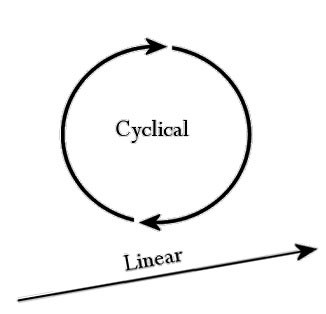
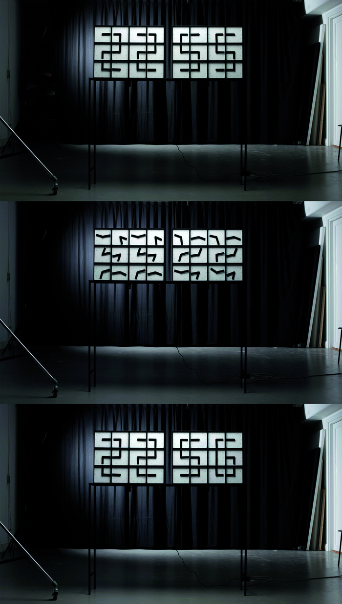
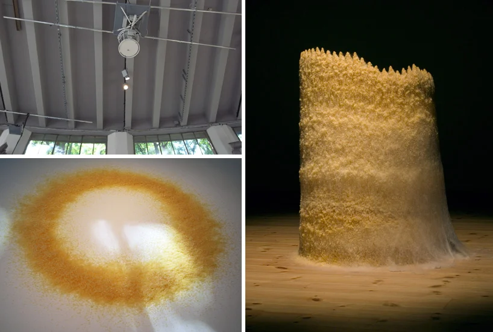
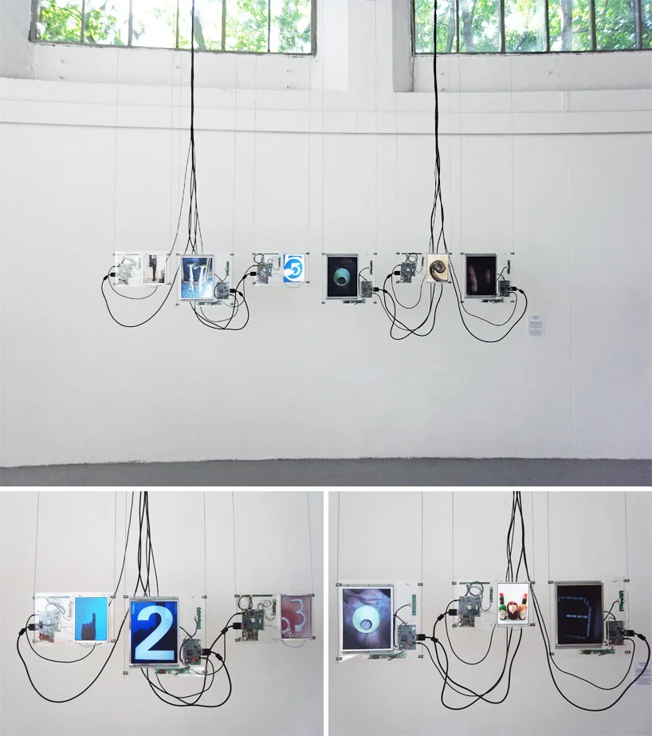
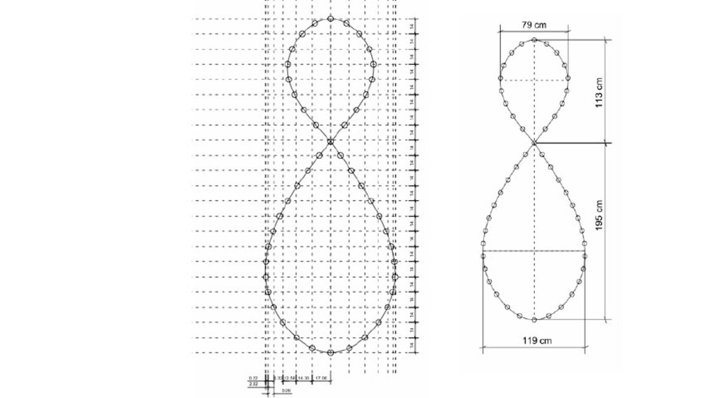
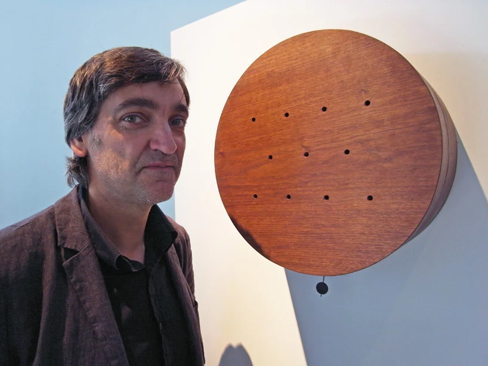
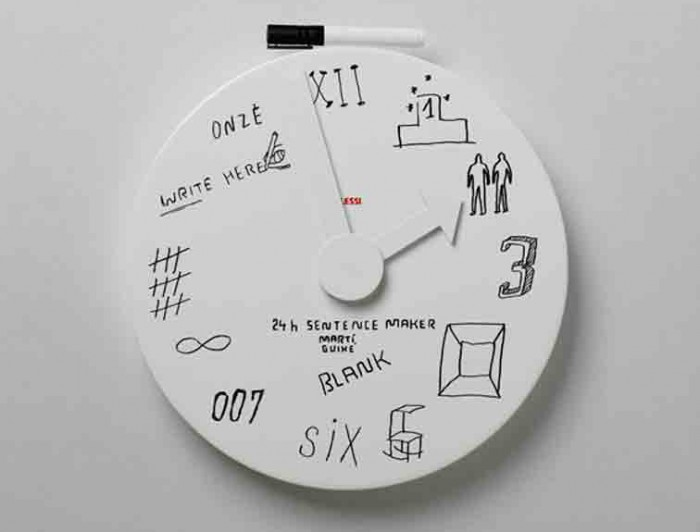

# Day 03

[_Allan Tannenbaum, PATTI SMITH (FUCK THE CLOCK), 1978_](https://www.modernrocksgallery.com/bands-n-s/patti-smith-fuck-clock-tannenbaum)  

Singer-songwriter Patti Smith wore her declamatory T-shirt, ironically, at a performance on New Year’s Eve 1978 at the legendary music club CBGB in New York City. Smith’s shirt was a rejection of modern, time-harried life. 
Today’s attorneys are a prime examples of being “on the clock.” Charging for their services based on the Time they spend on a client’s affair, they are pressured to account ever-accruing Time as “billable hours.” Tannenbaum, a noted photographer for more than four decades, has widely
documented the art world, music scene, politics, show business, and nightlife.

## Schedule

|Time               |Desc                                      |
|---                |---                                       |
|9:30 - 9:45        | Intro of the day                         |
|9:45 - 10:00       | Sharing                                  |
|10:00 - 12:00      | Work on assignement                      |
|12:00 - 13:00      | Lunch break :pizza:                      |
|13:00 - 15:00      | Work on assignement                      |

## :alarm_clock: Clock

### Brief

Today we'll work on building a device visualising the passing of time. Your design should be abstract enough and appear different at all times of the day. It should incorporate some kind of cycles as well. You should prevent from using letter and digits unless it's highly relevant with your concept and used in a unique way.

While designing your clock ponder things like biological time (chronobiology), ultradian rhythms and infradian rhythms, solar and lunar cycles, celestial time, geological time, decimal time, historical time, psychological time, and subjective time. [^note-id1]

__You must first sketch your idea on paper before working with the software.__ 

## Deliverables

* Code and documentation of your process, add some live example + gifs / images.
* Include a scan or photo of your drawings in the post

## More on time / clock

### The concept of time

Time and movement in art are closely linked. Time, however, is an abstract concept, with cultural and historical implications. It does not have the physicality that movement does. Time-based artwork is more ephemeral.

### Linear vs. circular, or cyclical time

In the concept of linear time there is a beginning (the past), and an end (the future). Between the two is the present, which is always moving forward.

  
[_American flow of time. Richard Lewis_](https://www.businessinsider.com/how-different-cultures-understand-time-2014-5)

  
[_Carving up American time. Richard Lewis_](https://www.businessinsider.com/how-different-cultures-understand-time-2014-5)

Digital clocks and time lines illustrate the idea of linear time very effecively.

  
[_Time line of art in the ancient world - Parthenon graphics_](http://chaos1.hypermart.net/fullsize/artancfs.gif)  

_Charles M. Schulz  6/11/2011  Daily comic on peanuts.com_

In contrast, circular, or cyclical time is a repeating process, like cycles and seasons, that creates continuous and infinite outcomes.  Analog clocks and labryinths are good examples of circular time.

Circular time nesting.

  
[_> source_](https://www.researchgate.net/figure/Portrayal-of-historical-experience-that-encompasses-both-linear-and-cyclical-modes-as_fig6_318292472)

### References

The clock clock white by humans since 1982 + [A million time](https://www.humanssince1982.com/a-million-times-san-jose-2021)

  
<iframe src="https://player.vimeo.com/video/52798481?h=ba2c0cd8e2&color=ffffff" width="640" height="360" frameborder="0" allow="autoplay; fullscreen; picture-in-picture" allowfullscreen></iframe>

<a href="https://vimeo.com/52798481">The clock clock white by humans since 1982</a> from <a href="https://vimeo.com/humanssince1982">Humans since 1982</a> on <a href="https://vimeo.com">Vimeo</a>.

  

  
[_‘clock’ by christiaan postma image © designboom_](https://www.designboom.com/design/oclock-time-design-design-time-at-triennale-design-museum-milan/)

Christiaan postma explains that the starting point with his project ‘the clock’ was a personal study about form & time. the dutch designer puts together more than 150 individual clockworks and arranges them work together to become one clock.  he shows the progress of time by letting the numbers be written in words by the clockhands. reading clockwise, the time being is visible through a word and readable by the completeness of the word, 12 words from ‘one’ to ‘twelve’. the size of the clock is 1,4 by 1,4 meter.

  
[_'‘0.5g min’ evolving sculpture by albin karlsson, 2007 images © designboom'_](https://www.designboom.com/design/oclock-time-design-design-time-at-triennale-design-museum-milan/)

A machine in the ceiling drip 0,5 gram of wax based hot glue every minute, at the same time the machine is rotating just like a hand in an analog clock. On the floor a stalagmite shape rises during time. [Project](https://www.albinkarlsson.com/1g-min/)

  
<iframe src="https://player.vimeo.com/video/606592643?h=295f4680bd&title=0&byline=0" width="640" height="427" frameborder="0" allow="autoplay; fullscreen; picture-in-picture" allowfullscreen></iframe>

<a href="https://vimeo.com/606592643">9-1.mp4</a> from <a href="https://vimeo.com/albinkarlsson">Albin Karlsson</a> on <a href="https://vimeo.com">Vimeo</a>.

  

[Countdown](https://www.albinkarlsson.com/countdown/)

  
[https://jhwilbert.com/portfolio/exquisite-clock/](https://jhwilbert.com/portfolio/exquisite-clock/)

  
[_Olafur Elliason - Beyond human time_](https://olafureliasson.net/archive/artwork/WEK110938/beyond-human-time)  
Beyond human time, was produced using pieces of ancient glacial ice that were fished from the sea off the coast of Greenland during production of the large-scale installation Ice Watch, 2014. 

[_Solar Noon_](https://olafureliasson.net/archive/artwork/WEK100480/solar-noon)

  
[_Chrono Shredder - SUSANNA HERTRICH (2020)_](http://www.susannahertrich.com/work/chrono-shredder-i-iv/)

  
[_‘time to eat’ by Marti Guixé_ ](https://www.designboom.com/design/oclock-time-design-design-time-at-triennale-design-museum-milan/)

‘time to eat’ by catalan designer martí guixé is a wall clock telling you it is time to eat by emitting the smell of cooking: 9am breakfast, 1pm cooking vegetable smell, 10pm preparing tomato sauce… – essence project lorenzo dante ferro

  
[_Time for Guixé at Milan 2010_](https://www.designindaba.com/articles/creative-work/time-guix%C3%A9-milan-2010)

Thorunn Arnadottir’s ’Sasa Clock’ comprises painted-wood beads hung over a slowly turning carousel. A bead slips down the cord every five minutes

Much, much more here --> [Golan Levin Lecture - Representing Time](https://github.com/golanlevin/lectures/tree/master/lecture_clock)

## References

### Example

  
<iframe src="https://preview.p5js.org/guma/embed/yZYaRwKAz" width="100%" height="450" frameborder="no"></iframe>
  

[_Simple Clock in P5.js_](https://editor.p5js.org/guma/sketches/yZYaRwKAz)

### :books: Resources

* [Coding challenge - Clock](https://www.youtube.com/watch?v=E4RyStef-gY)
* [Time as a spiral](https://forge.medium.com/theories-of-time-95783b12323a)
* [Perspective on time](https://www.theperspective.com/debates/living/perspective-time-linear-cyclical/)
* [International Atomic Time](https://www.timeanddate.com/time/international-atomic-time.html)

[^note-id1]: [CMU School of Art / IDeATe, Fall 2020 - Abstract Clock](https://courses.ideate.cmu.edu/60-212/f2020/deliverables/3-clock-due-9-16/)
