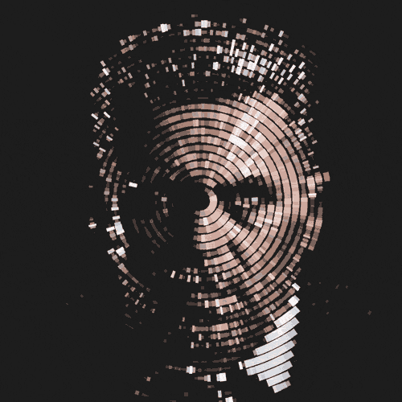
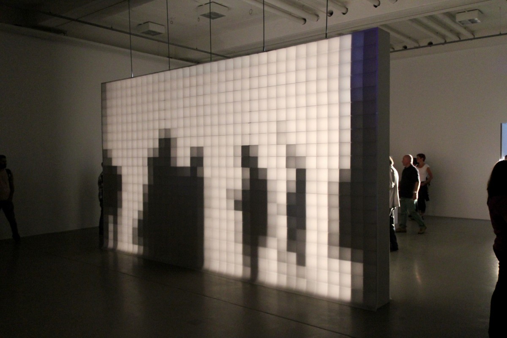
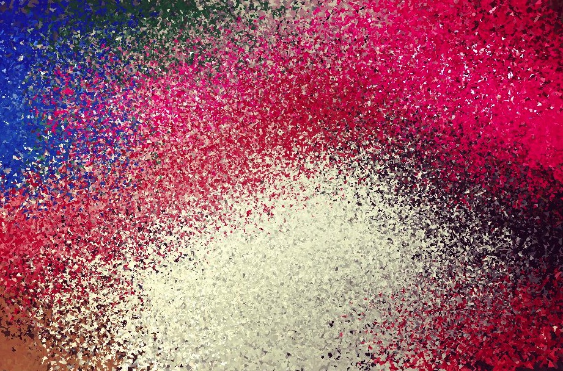
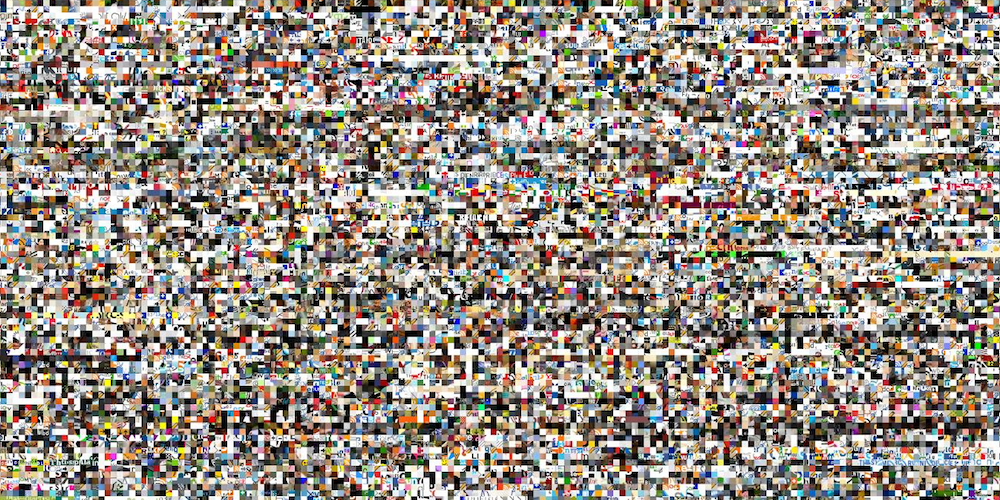
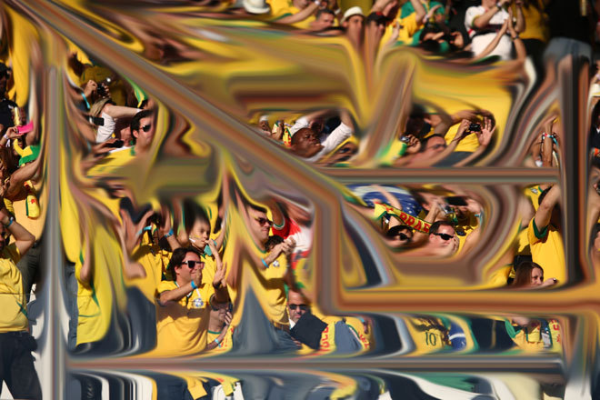
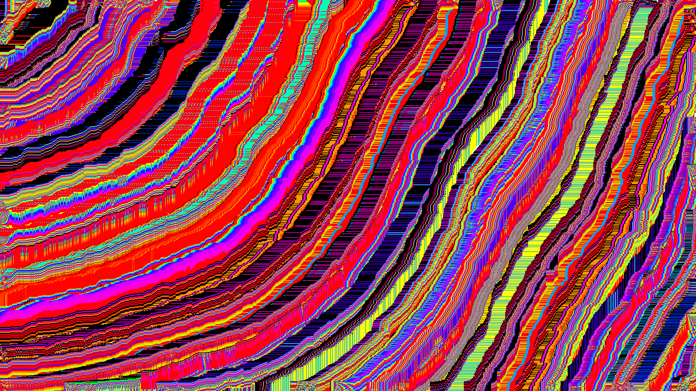
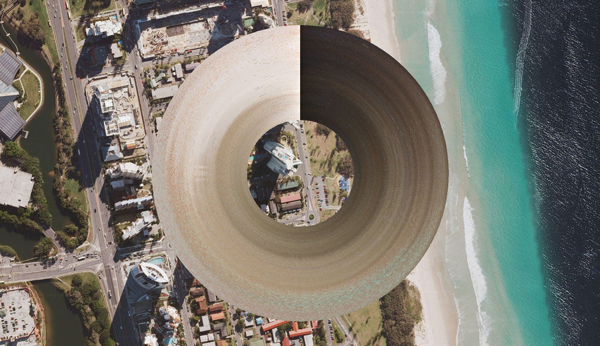
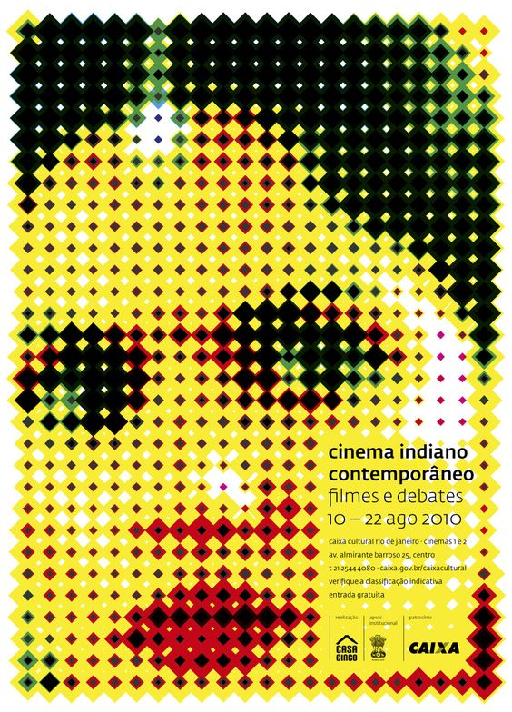
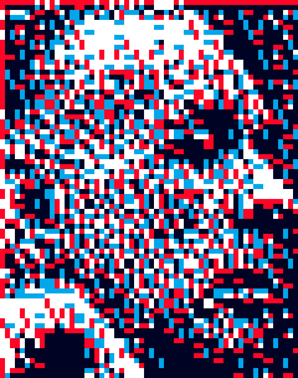

# Day 06

## Schedule

|Time               |Desc                                      |
|---                |---                                       |
|9:30 - 9:45        | Intro of the day                         |
|9:45 - 10:00       | Sharing                                  |
|10:00 - 12:00      | Work on assignement                      |
|12:00 - 13:00      | Lunch break :fried_shrimp:                      |
|13:00 - 15:00      | Work on assignement                      |

## :space_invader: Pixels

### Brief

Pixels are your materials for today's theme. Use them as a starting point to create an original design. You can use their color values, position and other parameters to create an original work. What if pixels had a different shapes? Or where arrange differently than in a nicely organised grid? What if they could be represented in a completely different form? Think carefully about the relationships between your pixel concept and the image you choose to transform. [^note-id1]

### Variations / Steps [^note-id1]

- [ ] Use a different coordinate system to construct your image (Polar coordinates?)
- [ ] Make pixels as brushstrokes
- [ ] Use video or webcam
- [ ] Play with compression, could you invent your own kind of compression? 

## Deliverables

* Code and documentation of your process, add some live example + gifs / images.
* Include a scan or photo of your drawings in the post

## More on pixels

### References

1 --> Search pixels projects on [CAN](https://www.creativeapplications.net/) _(username + password were sent on Slack yesterday)_  
2 --> Search fyprocessing for pixels projects, a __LOT__ of cool examples there :arrow_down:  

[_0,16 - Aram Bartholl_](https://arambartholl.com/016/)

0,16 is a light installation in which the shadows of a passer-by is transformed into ‘pixels’. The installation consists of a wall built of small square frames covered front and back with transparent paper. A third layer of paper is attached in the centre of the frames. A lamp shining at a distance breaks the shadows of the passers-by into squares, allowing a pixellated human figure to be seen on the other site of the installation. In this simple way, Bartholl renders tangible the pixels found in the world of digital communications. The ‘resolution’ of the screen is 0,16 ppi (pixels per inch), hence the title.

  
[_Pixel is Data - Matthieu Savary_](https://www.creativeapplications.net/cinder/pixel-is-data-by-matthieu-savary-reorders-pixels-in-your-photos/)  

Created by Matthieu Savary, Pixel is Data is not your ordinary photography app for the iOS. Instead of dealing with pixels as you’d expect, all in order to represent the scene you have just photographed, Pixel is Data uses the image data and shows it using various parameter to reorder the pixels. They can be arranged either the “right” way – their photographic order, or using the RGB components of each pixel to determine priority.

<% raw %>  
<iframe width="560" height="315" src="https://www.youtube.com/embed/qhdG7OltXnU" title="YouTube video player" frameborder="0" allow="accelerometer; autoplay; clipboard-write; encrypted-media; gyroscope; picture-in-picture" allowfullscreen></iframe>  
<% endraw %>  
[_IRIS_](https://www.creativeapplications.net/processing/iris-by-hybe-new-kind-of-monochrome-lcd/)  
Created by Korean collective HYBE, IRIS is a media canvas with matrix of conventional information display technology, that is a monochrome LCD.Through the phased opening and closing of circular black liquid crystal, IRIS can create various patterns and control the amount (size) of passing lights.

  
[_100.000.000 Stolen Pixels_](https://www.creativeapplications.net/scripts/100-000-000-stolen-pixels-scripts/)  
100.000.000 stolen pixels is a personal project by Kim Asendorf in attempt to create an archive of numerous sites by ‘stealing pixels’ from them. A web crawler created by Kim started with 10 URLs (See first 10 in url.log) and searched HTML pages for images and hyperlinks. Each found image got downloaded and 100 pixels in a square of 10×10 were cut out of it. Each found hyperlink got stored in the cache and thereby added to the list of searchable URLs.

  
  
  
  
  
_:arrow_up: KIM ASENDORF - Misc_  

<% raw %>  
<iframe width="560" height="315" src="https://www.youtube.com/embed/-o-p8TAu4aE" title="YouTube video player" frameborder="0" allow="accelerometer; autoplay; clipboard-write; encrypted-media; gyroscope; picture-in-picture" allowfullscreen></iframe>  
<% endraw %>  

  
  
  

  
[_Kensuke Koike 小池健輔_](https://twitter.com/k_koi/status/1344428323049504769)  

> You will find code examples in the book [Generative Gestaltung (P_4_...)](http://www.generative-gestaltung.de/2)  
> Check :sparkles: [Pinterest Portrait board](https://www.pinterest.ch/9uill0m/generative-class/portrait/)   *(temp pinterest account: tmp.pin@gmail.com / TT4[bosses )*  
> [Pinterest class board](https://www.pinterest.ch/9uill0m/generative-class/)

### Examples

  

  See the Pen <a href="https://codepen.io/gu-ma/pen/LggyKa">
  Demo 02</a> by G. (<a href="https://codepen.io/gu-ma">@gu-ma</a>)
  on <a href="https://codepen.io">CodePen</a>.

  
  

[Cam pixels in P5.js](https://codepen.io/gu-ma/pen/LggyKa)

### :books: Resources

* [Really complete post on the topic - Check it out!](https://hackernoon.com/appreciating-art-with-algorithms-58b651615561)

[^note-id1]: [Code as Creative Medium - Tega Brain / Golan Levin](https://mitpress.mit.edu/books/code-creative-medium)